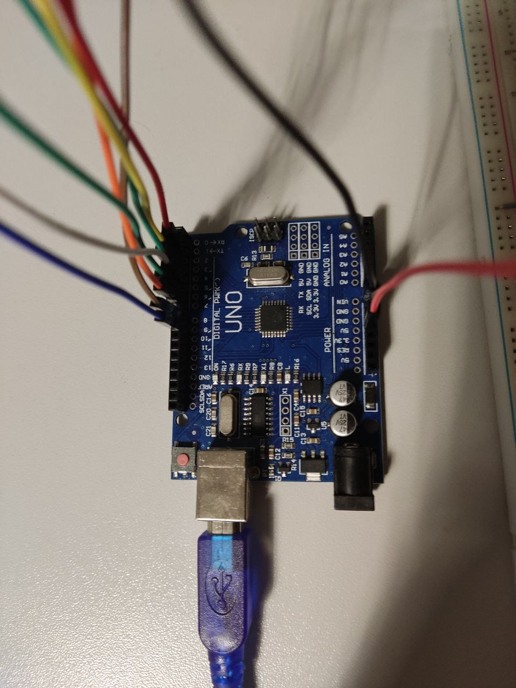
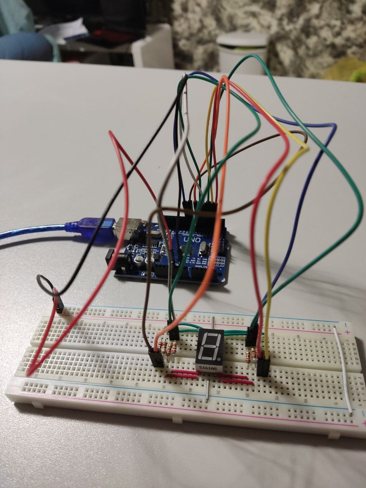
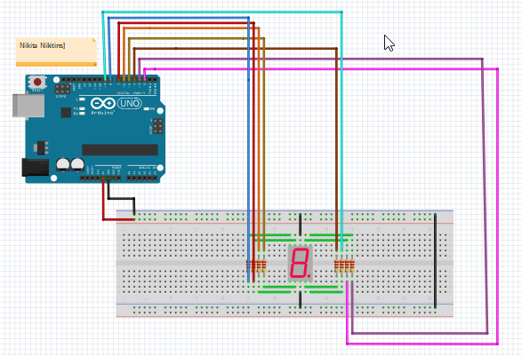
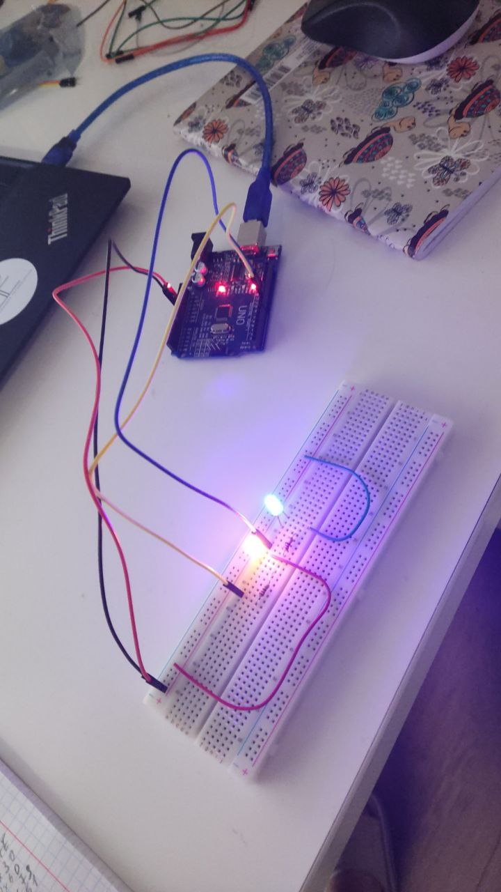
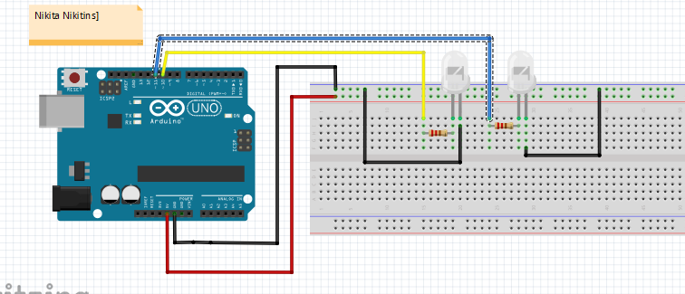

# Arduino Projects

Created arduino projects using C programming language and ATMega328p Arduino UNO.

## Components List

|                            |       Count        | 
| -------------------------- | :----------------: | 
| Resistors                  |       10...15      | 
| Piezoelectric Buzzer       |       1            | 
| LCD1602 with I2C interface \n (connected with a soldering iron) |       1            | 
| 4x4 Micro Switch Matrix Keypad|    1            | 
| 8x8 LED matrix             |       1            | 
| 5461AS-1 4-digit 7-segment LED display  |        1          | 
| 5461AS 1-digit 7-segment LED display       |         1        | 
| Sound Sensor Module        |       1            | 
| DHT11 Temperature And Relative Humidity Sensor   |         1         | 
| KEYES RGB LED module       |         1          | 
| AC Relay Module (TONGLING 5VDC JQC-3FF-S-Z)  |         1      |
| Water Sensor v1.0          |       1            |
| RFID Reader                |       1            |
| Potentiometer              |       1            |
| LEDs                       |       70...75      |
| Micro Servo                |       1            |
| mh real time clock module 2|       1            |

## Projects

* [5161AS 7-segment display project](#5161AS-7-segment-display-project)
* [2 LEDs blinking](#2-leds-blinking)

### 5161AS 7-segment display project
---
**`Video` ->  [7-segment display ready project demonstration](https://youtube.com/shorts/5uuckVPyVYM).**

#### [`Project Link`](https://github.com/MidTempoCodeLabs/arduino_projects/tree/main/7_segment_screen_5161AS)

#### connection photo

#### Created scheme in Fritzing

### 2 LEDs blinking
---
**`Video` ->  [2 LEDs blinking project demonstration](https://youtube.com/shorts/E62ZbkbDvd0).**

#### [`Project Link`](https://github.com/MidTempoCodeLabs/arduino_projects/tree/main/2_LEDs_blinking)

#### connection photo

#### Created scheme in Fritzing

