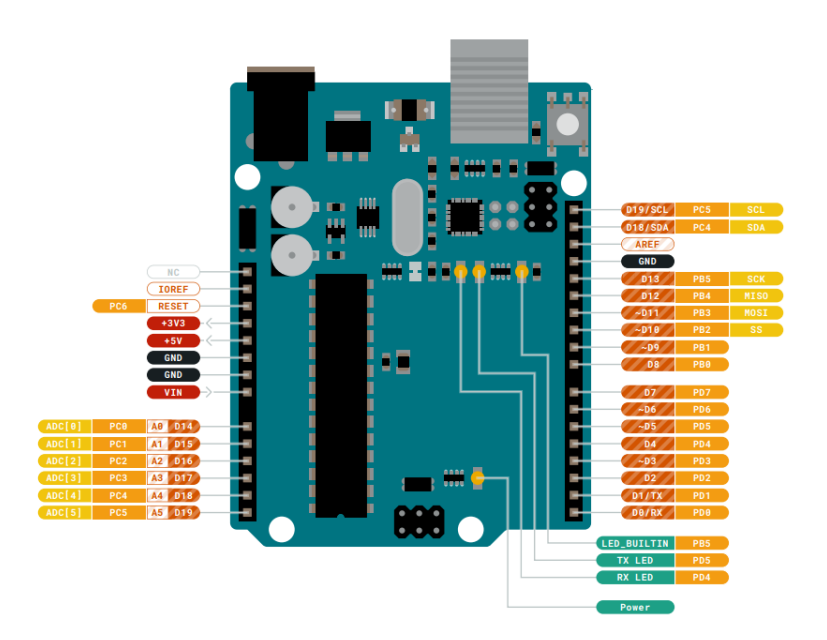

# Arduino Projects

Created arduino projects using C programming language and ATMega328p Arduino UNO.

## Projects

* [5161AS 7-segment display project](#5161AS)

### 5161AS 7-segment display project
---
**`Video` ->  [7-segment display ready project demonstration](https://youtube.com/shorts/5uuckVPyVYM).**

#### [`Project Link`](https://github.com/MidTempoCodeLabs/arduino_projects/tree/main/7_segment_screen_5161AS)